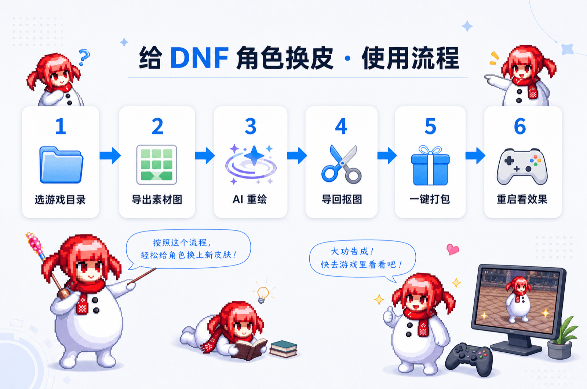

<h1 align="center">DNF 职业补丁制作工具</h1>

<p align="center">在浏览器里给《地下城与勇士》职业角色做自定义外观补丁 &nbsp;·&nbsp; Make custom appearance patches for Dungeon &amp; Fighter (DNF) job avatars, right in your browser</p>

<p align="center"></p>

<p align="center"><b>在线版 / Live:</b> <a href="https://321fight.top">https://321fight.top</a> &nbsp;·&nbsp; <b>License:</b> MIT</p>

---

## English

A browser tool to make **custom appearance patches** for **DNF (Dungeon & Fighter)** job/class avatars — everything runs locally, nothing is uploaded.

**How it works:** pick your `ImagePacks2` folder → export a class's sprite frames as a green-background grid → repaint it with any AI image model → drop the result back → the tool auto-keys out the background and aligns the feet → it packs a `%`-prefixed override patch the game loads. The original `.ani` files are never touched, so hitboxes and frame timing stay intact.

Pure client-side: **TypeScript + Vite + WebAssembly** (an NPK unpacker built on [npk-api](https://github.com/hooyantsing/npk-api), compiled to WASM); unpack/repack run in a Web Worker so the UI never freezes. Needs Chrome / Edge (File System Access API).

### Run

```bash
cd browser
npm install
npm run dev        # open the URL Vite prints (default http://localhost:5173)
```

| Command | What |
| --- | --- |
| `npm run build` | Production build → `browser/dist/` (static, host anywhere) |
| `npm test` | Unit tests (vitest) |
| `npm run typecheck` | TypeScript check |

Architecture: [`browser/ARCHITECTURE.md`](browser/ARCHITECTURE.md). The WASM engine binary is **not committed** — build it from the npk-api-based engine with emscripten, see [`browser/wasm/README.md`](browser/wasm/README.md).

## 中文

纯浏览器的 **DNF（地下城与勇士）** 职业外观补丁制作工具，全程在本地跑、不上传任何文件。

**怎么用：** 选游戏的 `ImagePacks2` 文件夹 → 把职业的精灵帧导出成绿底网格图 → 用任意 AI 图像模型重绘 → 把结果拖回工具 → 自动抠掉背景、脚底对齐 → 回封成游戏认的 `%` 覆盖补丁。不改 `.ani`，判定和帧时序原样保留。

技术：**TypeScript + Vite + WebAssembly**（NPK 解包引擎基于 [npk-api](https://github.com/hooyantsing/npk-api) 编成 WASM），解包/回封跑在 Web Worker、界面不卡。需 Chrome / Edge。

运行：`cd browser && npm install && npm run dev`，命令见上表。WASM 引擎二进制不入库，需自行编译（见 [`browser/wasm/README.md`](browser/wasm/README.md)）。

## 致谢 / Credits

NPK 解包 / 封包能力基于 **[npk-api](https://github.com/hooyantsing/npk-api)**（作者 hooyantsing · Apache-2.0）二次开发。
The NPK unpack / repack capability is built on and extends **[npk-api](https://github.com/hooyantsing/npk-api)** by hooyantsing (Apache-2.0).

---

<sub>仓库也包含一个 Python 桌面版（<code>core/</code> + <code>server.py</code>，<code>./run.sh</code> 启动）。The repo also ships an earlier Python desktop version.</sub>
